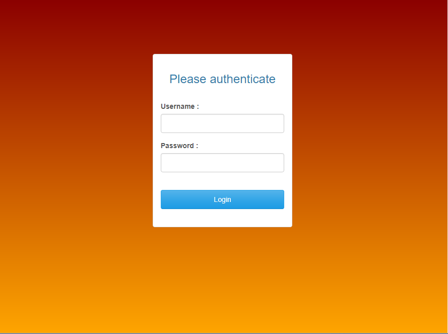

# Password-Protected-Dashboard

```
library(shiny)
library(shinymanager)
library(shinydashboard)

credentials <- data.frame(
  user = c("Fahim", "Guest"),
  password = c("password1", "1234")
)


ui <- secure_app(
  theme = shinythemes::shinytheme(theme = "cerulean"),
  background  = "linear-gradient(darkred, orange)",
  ## Add an image
  # tag_img = tags$img(src = "https://www.r-project.org/logo/Rlogo.png", width = 100),
  dashboardPage(
    dashboardHeader(),
    dashboardSidebar(),
    dashboardBody(
      HTML("<h2 style='color:darkred; text-align:center'>Password Protected Shiny App</h2>")
    )
  )
)


server <- function(input, output, session) {
  
  result_auth <- secure_server(
    check_credentials = check_credentials(credentials),
    timeout = 10
    )
}

shinyApp(ui, server)
```



